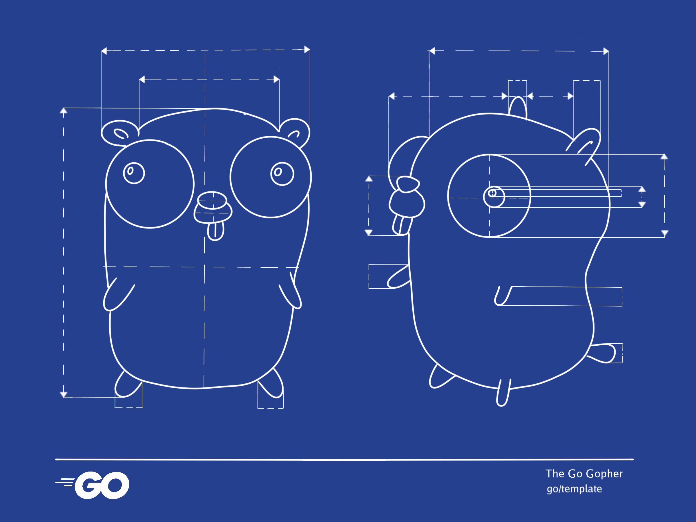

# `go/template`

[](https://jobs.schwarz)
[](https://github.com/SchwarzIT/go-template/actions/workflows/main.yml)
[](https://goreportcard.com/report/github.com/SchwarzIT/go-template)
[](https://pkg.go.dev/github.com/schwarzit/go-template)

`go/template` provides a **blueprint** for production-ready Go project layouts.


> Credit to Renée French for the [Go Gopher logo](https://go.dev/blog/gopher)  
> Credit to Go Authors for the [official Go logo](https://go.dev/blog/go-brand)

## Batteries included

- Makefile for most common tasks
- optimized Dockerfile
- golangci-lint default configuration
- pre-push git hook to ensure no linting issues
- gRPC support
- folder structure based on [github.com/golang-standards/project-layout](https://github.com/golang-standards/project-layout)
- enforced default packages
  - `go.uber.org/zap` for logging
  - `go.uber.org/automaxprocs` to be safe in container environments (see [this article](https://martin.baillie.id/wrote/gotchas-in-the-go-network-packages-defaults/#bonus-gomaxprocs-containers-and-the-cfs) for more information)

## Usage

### Installation

#### From source

If you have Go 1.21+, you can directly install by running:

```bash
go install github.com/schwarzit/go-template/cmd/gt@latest
```

> Based on your go configuration the `go/template` binary can be found in `$GOPATH/bin` or `$HOME/go/bin` in case `$GOPATH` is not set.
> Make sure to add the respective directory to your `$PATH`.
> [For more information see go docs for further information](https://golang.org/ref/mod#go-install). Run `go env` to view your current configuration.

#### From the released binaries

Download the desired version for your operating system and processor architecture from the [go-template releases page](https://github.com/SchwarzIT/go-template/releases).
Make the file executable and place it in a directory available in your `$PATH`.

#### nix

`go-template` also provides a [flake.nix](flake.nix) to install it via [nix package manager](https://github.com/NixOS/nix).

You can also try out `go-template` without installing:

```shell
nix run github:schwarzit/go-template
```

### Preconditions

`go/template`'s `gt` CLI requires at least the following executables on `$PATH` to run succesfully:

- Go >= 1.21
- Git

These are used at the end of `gt new`'s execution to initialize Git and Go modules in the newly created project repository.

### Initialize your repo from the template

[](https://asciinema.org/a/441624?autoplay=1&speed=2&size=medium)

Use the template to generate your repo:

```bash
gt new
```

Initialize the project:

```bash
cd <your project>
make all
```

## Options

To get an overview of all options that can be set for the template you can take a look at the [options docs](docs/options.md), run the CLI or check out the [testing example values file](pkg/gotemplate/testdata/values.yml).

## Contribution

If you want to contribute to `go/template` please have a look at our [contribution guidelines](CONTRIBUTING.md).

## Releasing

The release process is described in the [release docs](docs/release.md).
